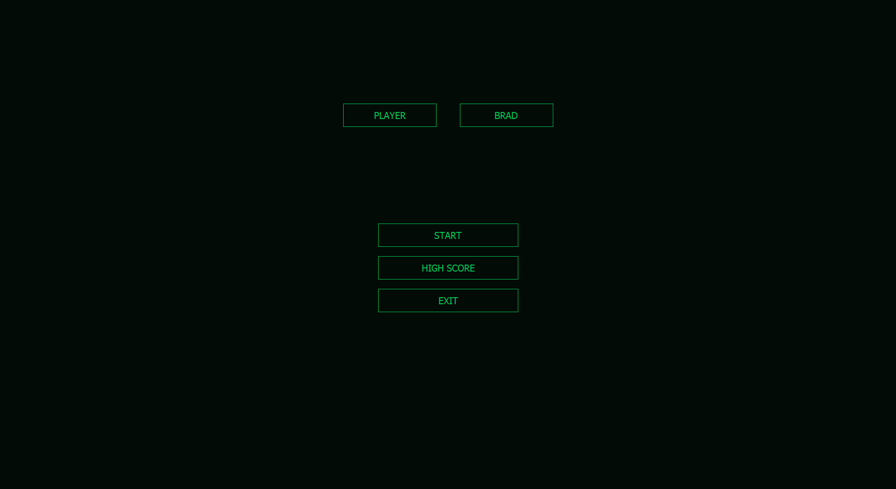
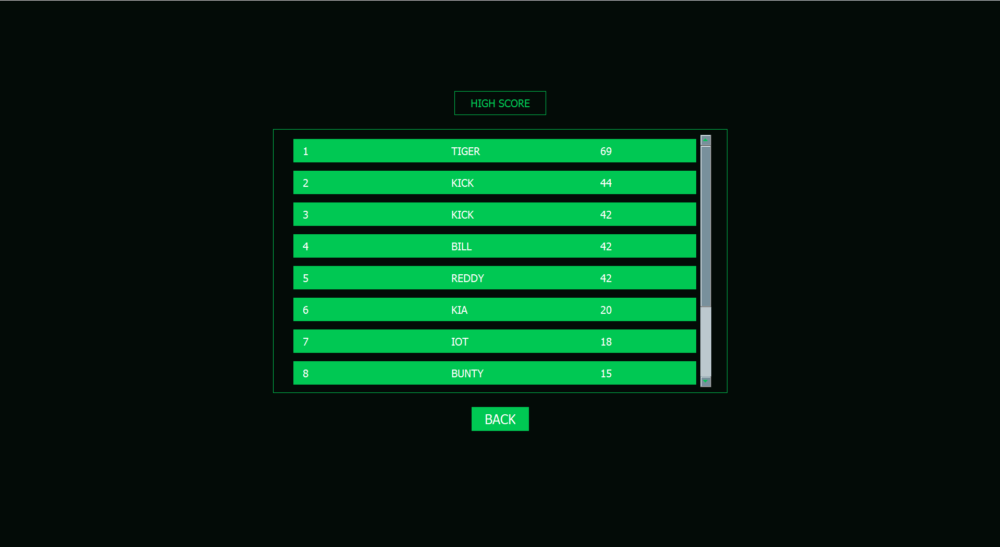
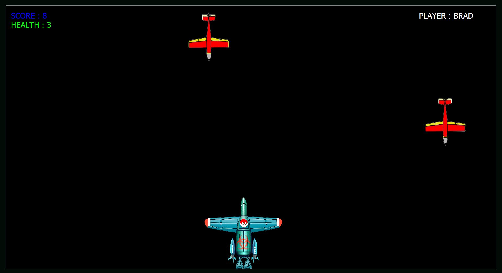
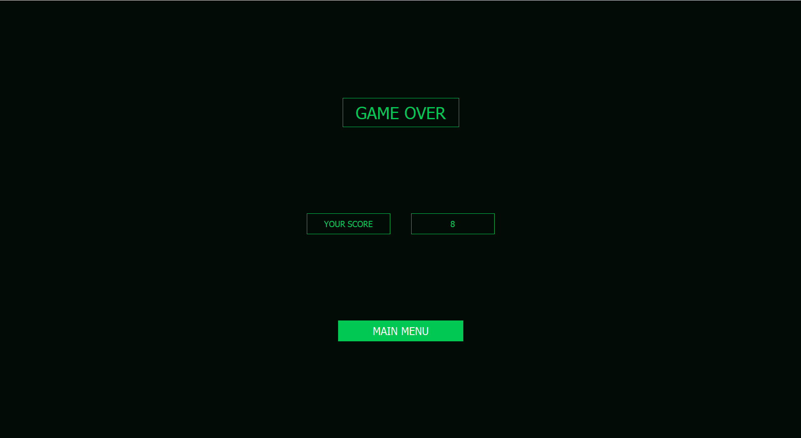

# Fighter Plane Game

Welcome to the Fighter Plane Game, a project created using Qt 5.15. This game utilizes Qt Widgets, QGraphicsScene, QGraphicsPixmapItem, and features key events and media player for an interactive gaming experience.

## Screenshots and GIFs

## Features

- Use of Qt Widgets for the user interface.
- Graphics rendering using QGraphicsScene and QGraphicsPixmapItem.
- Interactive gameplay with key events for controlling the fighter plane.
- Sound effects and background music using the Qt MediaPlayer.

## How to Run

1. Clone this repository:

2. Open the project using Qt Creator or your preferred IDE.

3. Build and run the application.

## x64_bin

1. x64_bin contains the executable and required dll files. You can run the game from there directly.

## Credits

This project was created by [Harshal Patil](https://github.com/harshal365247).

## License

This project is licensed under the [MIT License](LICENSE).

Feel free to explore, contribute, and enjoy the game!
